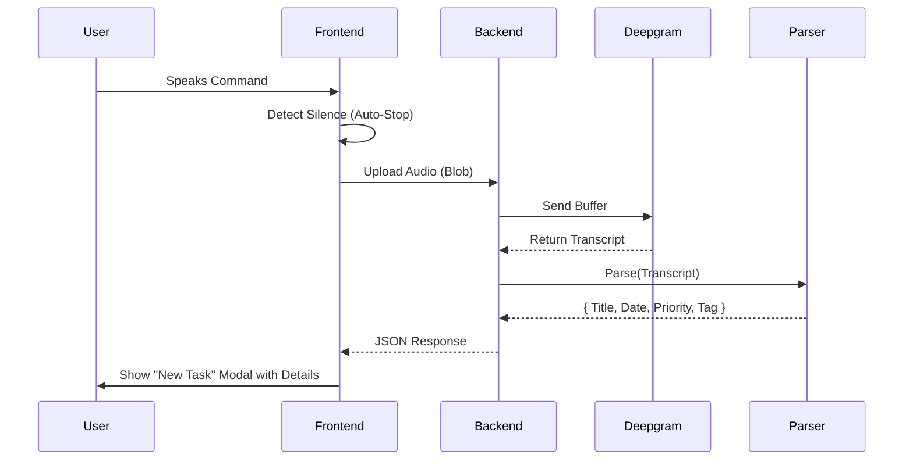
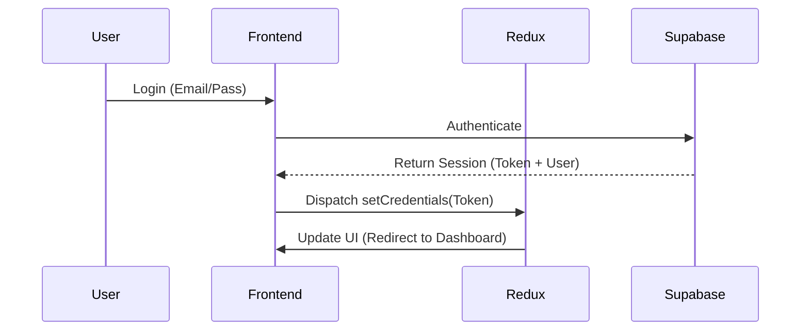

# 🎙️ TaskWhisper - Voice-Enabled Task Manager

TaskWhisper is a full-stack, voice-enabled task management application that streamlines your productivity by allowing you to create, manage, and organize tasks using natural voice commands.

Powered by **Deepgram** for state-of-the-art speech-to-text transcription and an intelligent Natural Language Processing (NLP) parser, TaskWhisper converts your spoken words into structured tasks with titles, due dates, priorities, statuses, and tags automatically.

Built with a modern tech stack—**React, Redux Toolkit, Node.js, and Supabase**—it offers a seamless, synchronized experience across devices.

---

## 🚀 Key Features

### 🗣️ Voice Command & AI Parsing
- **One-Tap Recording**: Instantly start recording your task.
- **Deepgram Transcription**: High-accuracy speech-to-text conversion.
- **Smart Parsing**: Automatically extracts:
  - **Title**: The core task.
  - **Date/Time**: e.g., "tomorrow at 5pm", "next Friday".
  - **Priority**: Detects keywords like "urgent", "high priority", "critical".
  - **Status**: Detects "in progress", "done".
  - **Tags**: Categorizes tasks (e.g., "Work", "Home", "Finance").
  - **Multilingual Support**: Language selector UI, Deepgram multilingual transcription, and NLP parsing for English, Spanish, French, German, and Hindi.
- **Review Mode**: See the transcript and parsed details before saving.

### ✅ Task Management
- **Manual Creation/Editing**: Full control to create or modify tasks manually.
- **Delete & Organize**: Remove tasks or move them between statuses.
- **Dashboard Views**:
  - **Kanban Board**: Drag-and-drop tasks between "To Do", "In Progress", and "Done".
  - **List View**: A detailed table view for quick scanning.

### 🔐 Authentication & Sync
- **Secure Auth**: Powered by Supabase (Email/Password).
- **Session Persistence**: Auto-token refresh and persistence via Redux.
- **Real-time Sync**: Optimistic updates ensure the UI feels instant, while the backend syncs in the background.

---

## 🛠️ Tech Stack

### Frontend
- **Framework**: React 18 + Vite (Fast HMR)
- **Language**: TypeScript
- **Styling**: Tailwind CSS + Shadcn UI (for polished components)
- **State Management**: Redux Toolkit (Slices, Thunks, Persistent Auth)
- **Animations**: Framer Motion

### Backend
- **Runtime**: Node.js + Express
- **Transcription**: Deepgram SDK
- **Parsing**: `chrono-node` (dates), `compromise` (NLP), Custom logic
- **Database**: Supabase (PostgreSQL)
- **Storage**: Supabase Storage (for avatars/media if needed)

### Dev Tools
- **Linting**: ESLint + Prettier
- **Version Control**: Git

### Mobile
- **Framework**: React Native + Expo
- **Language**: TypeScript
- **Styling**: NativeWind (Tailwind CLI)
- **State Management**: Redux Toolkit
- **Navigation**: Expo Router

---

## 📋 Prerequisites

Before running the project, ensure you have:
1.  **Node.js** (v18+)
2.  **npm** or **pnpm**
3.  **Supabase Account**: For Database & Auth.
4.  **Deepgram API Key**: For Speech-to-Text.
5.  **Microphone Access**: Allowed in your browser.

---

## 📂 Project Structure

```bash
taskWhisper/
├── backend/ # Node.js Express Server
│   ├── src/
│   │   ├── config/ # Deepgram & Supabase Config
│   │   ├── controllers/# Route Controllers (Voice, Tasks)
│   │   ├── routes/ # API Routes
│   │   ├── utils/ # NLP Parser, Helpers
│   │   └── app.js # Entry point
│   └── package.json
│
├── frontend/ # React Vite App
│   ├── src/
│   │   ├── components/ # Reusable UI Components
│   │   │   ├── tasks/ # Task Modals (New, Edit)
│   │   │   └── ui/ # Shadcn UI primitives
│   │   ├── pages/ # Dashboard, Login, Board, List
│   │   ├── store/ # Redux Setup
│   │   │   ├── slices/ # Auth & Task Slices
│   │   │   └── thunks/ # Async Actions (API calls)
│   │   └── App.tsx # Main Router
│   └── package.json
│
└── README.md
```

---

## 🌿 Environment Variables

Create a `.env` file in **both** `frontend` and `backend` directories.

### Frontend (`frontend/.env`)
```bash
VITE_API_URL=http://localhost:5173
```

### Backend (`backend/.env`)
```bash
PORT=3010
DEEPGRAM_API_KEY=your_deepgram_api_key
SUPABASE_URL=your_supabase_project_url
SUPABASE_KEY=your_supabase_anon_key
# Or use Service Role if you need admin access
SUPABASE_SERVICE_ROLE_KEY=your_supabase_service_role_key
```

---

## ⚡ Setup Guide

### 1. Supabase Setup
1.  Create a new project on [Supabase](https://supabase.com).
2.  Go to **SQL Editor** and run this query to create the tasks table:
    ```sql
    create table tasks (
      id uuid default uuid_generate_v4() primary key,
      user_id uuid references auth.users not null,
      title text not null,
      description text,
      status text default 'To Do',
      priority text default 'Medium',
      due_date timestamp with time zone,
      tag text,
      created_at timestamp with time zone default timezone('utc'::text, now()) not null,
      updated_at timestamp with time zone default timezone('utc'::text, now()) not null
    );
    ```
3.  Enable RLS (Row Level Security) and add a policy:
    -   "Enable read/write for users based on user_id".

### 2. Deepgram Setup
1.  Sign up at [Deepgram](https://deepgram.com/).
2.  Create an API Key with "Member" scope.
3.  Add it to your `backend/.env`.

### 3. Backend Setup
```bash
cd backend
npm install
npm run dev
# Server running at http://localhost:3010
```

### 4. Frontend Setup
```bash
cd frontend
npm install
npm run dev
# App running at http://localhost:5173
```

### 5. Mobile Setup
```bash
cd taskWhisper-mobile
npm install
# Start for Android
npx expo start --android
# Start for iOS (Mac only)
npx expo start --ios
```

---

## 🎙️ Voice Auto-Silence Detection

The frontend uses the Web Audio API to detect when you stop speaking.
1.  **AudioContext**: Creates an audio processing graph.
2.  **AnalyserNode**: Analyzes the real-time frequency/volume data.
3.  **Threshold Logic**:
    -   If volume < `SILENCE_THRESHOLD` for > 2.5 seconds, recording stops automatically.
    -   This prevents "empty air" at the end of recordings and provides a hands-free experience.

---

## 🧠 Redux Architecture

### `authSlice`
-   **State**: `user`, `token`, `isAuthenticated`, `isLoading`.
-   **Actions**: `login`, `logout`, `register`.
-   **Persistence**: Checks local storage on boot to restore session.

### `tasksSlice`
-   **State**: `list` (Array of tasks), `isLoading`, `lastFetched`.
-   **Caching**: Prevents re-fetching tasks if called within 5 minutes (`staleTime`).
-   **Optimistic Updates**: When you move a card on the Kanban board, Redux updates the UI *immediately* before the API confirms, creating a snappy feel.

---

## 🔄 API Flow Diagrams

### Voice to Task Flow


### Auth Flow


---

## 🔮 Future Improvements
-   [ ] **Real-time Collaboration**: Use Supabase Realtime to show task moves instantly to other users.
-   [x] **Mobile App**: Port frontend to React Native (Expo) - *Beta Released*.
-   [ ] **Offline Mode**: Cache tasks locally using `redux-persist` for offline editing.
-   [ ] **LLM Integration**: Replace regex parser with OpenAI/Gemini for smarter context understanding.
-   [ ] **Multilingual Support**: Added language selector UI, Deepgram multilingual transcription, locale-aware NLP parsing (English, Spanish, French, German, Hindi) and database schema updates for language handling.

---

## 📄 License

Distributed under the MIT License. See `LICENSE` for more information.

---

Made with ❤️ by Simrandeep Singh.
